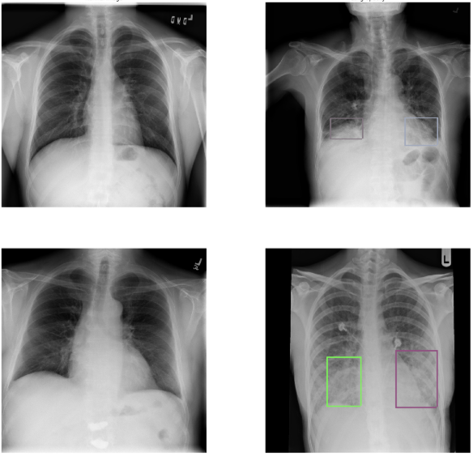

# RSNA-Pneumonia-Detection
⚡Lung opacity detection using Mask R-CNN

## Requirements
- Python3
- Tensorflow 1.15.0
- Keras 2.8.0

## RSNA-Pneumonia-Detection
https://www.kaggle.com/c/rsna-pneumonia-detection-challenge/data

### What is Pneumonia?
Pneumonia is an infection in one or both lungs. Bacteria, viruses, and fungi cuase it.

The infection causes inflammation in the air sacs in your lungs, which are called alveoli. The alveoli fill with fluid or pus, making it difficult to breathe.

### About Dataset
- Patient ID : 26684
But we used only 2000 for quick training (train set: 1800, test set: 200)

Class categories
- No Lung Opacity / Not Normal: 39%
- Lung Opacity: 32%
- Normal: 29%

In this case, we considered the lung opacity category is abnormal, which is target things.

### The purpose of the challenge
The thing that we have to do is 'Lung Opacities Detection'.
Lung opacities are vague, fuzzy clouds of white in the darkness of the lungs, which makes detecting them a real challenge.

#### Normal vs. Lung Opacity images

## Mask RCNN

Mask RCNN is a deep neural network aimed to solve instance segmentation problem in machine learning or computer vision. In other words, it can separate different objects in a image or a video. You give it a image, it gives you the object bounding boxes, classes and masks.

If you want to know about Mask RCNN, please check this link. https://github.com/namyouth/Mask_R-CNN/blob/master/Mask_R-CNN_Explained.ipynb

## Results

